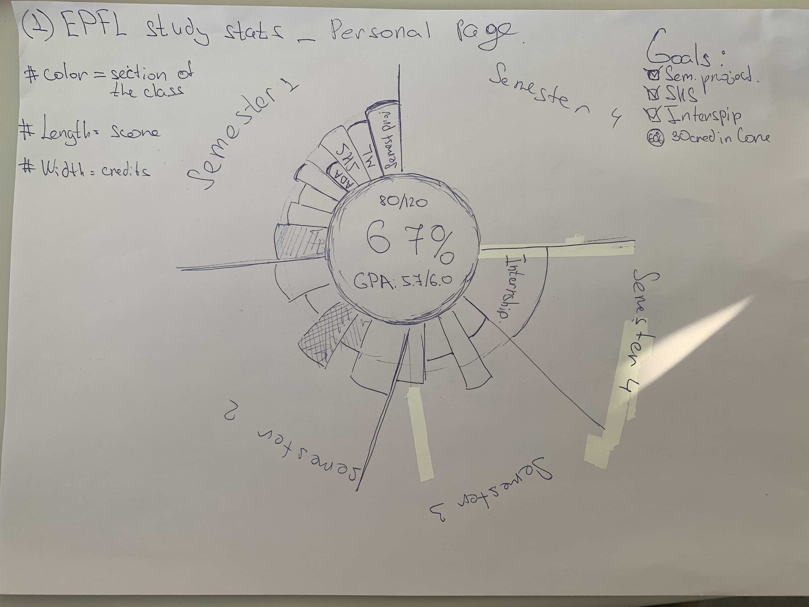
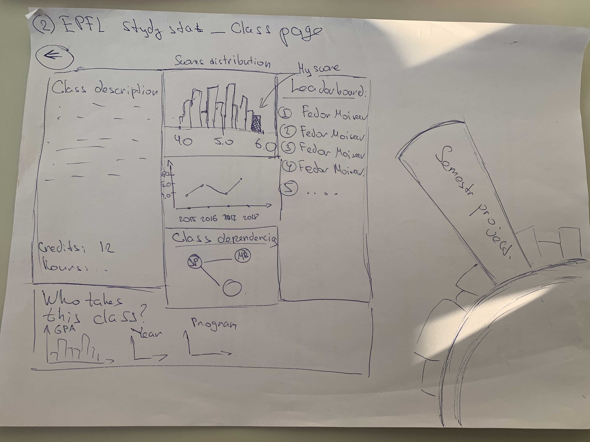

# Project of Data Visualization (COM-480)

| Student's name | SCIPER |
| -------------- | ------ |
| Davit Martirosyan | 309563 |
| Fedor Moiseev | 309259 |
| Artem Lukoianov| 309185|

[Milestone 1](#milestone-1-friday-3rd-april-5pm) • [Milestone 2](#milestone-2-friday-1st-may-5pm) • [Milestone 3](#milestone-3-thursday-28th-may-5pm)

## Milestone 1 (Friday 3rd April, 5pm)

**2.1 Dataset**  

After careful consideration of possible data visualization projects that we could do based on standard datasets, we decided to take a different route by collecting our own data and building a website that shows a breakdown of selected EPFL courses for each semester for a student.
Where do we get the data - a student uploads their grade transcript available on IS-Academia to our website, which we then parse to get the relevant data, e.g. grades for each course. In addition, we parse PDFs describing the courses to extract information about teacher, course description, and prerequisites.
The only true challenge with this dataset is the pdf parsing otherwise the data is clean and ready to be used for visualization.

**2.2 Problematic**  

The motivation for this project came from our own experience of finding it difficult to quickly see the useful information within our grade transcripts:
1. There is no way to compute the GPA other than manually, and each student does that when updating their CV.
2. Grade distribution at EPFL is very different compared to other universities and thus it is much better to put percentiles in CV (top 5% of students sounds much better than 5.5/6 GPA). This information is not available at all.
3. It is not easy to track all the requirements of your program.
4. Because there isn’t any readily available course statistics over the years, it is very hard to get a sense of how easy/difficult the course is and where a student ranks based on their grade, etc.

We want to provide a visual analytics platform for us and other EPFL students where they could see all information about their studies in one place. This could also be beneficial for the university lecturers to compare courses, see class dependencies, etc.

Our ideas can be split into 3 main parts:
1.	Information specific to student:
Visualization of completed courses and received marks, requirements (e.g. number of core credits, SHS, internships) etc.
2.	General public information:
Course descriptions, teachers, graph of courses where edges represent “is prerequisite” relationship.
3.	General private information (requires students’ private data):
Distribution of scores for each course, evolution of course statistics over the years, etc.

We plan to put all these components together into beautiful interactive visualization ;)

We also realize that we should be careful providing class statistics to not violate anyone’s privacy. For this purpose, a student will always be asked if they want to include their information in course statistics and only then overall trends/distributions will be shown. 

**2.3 Exploratory Data Analysis**  

Due to specificity of task, we can’t provide explanatory statistics, because every user will see different visualizations. Instead of it, we state some general information about task that we going to include into our visualizations. Information for CS&DS master students:

Each student should complete 30 core credits
Each student should complete 120 total credits
Each student can have no more than 15 credits outside of study plan
Each student can have no more than 12 non-technical credits
Each student should complete an internship
Each student should complete a semester project

**2.4 Related work**  

No work has been done previously with this dataset, and our approach is original for two reasons – 1. EPFL doesn’t have the described platform for its students, and 2. we saw a few histograms, time series graphs of various student performance metrics, but we haven’t come across to a visualization like ours.

Possible visualization techniques:
[Radial histogram](https://datavizproject.com/data-type/radical-histogram/) to visualize grades fro completed courses (interactive, of course ;))
Graph (like [this one](https://s3.amazonaws.com/dev.assets.neo4j.com/wp-content/uploads/example-viz.png)) to visualize relationships between courses

**2.5 Additional: Preliminary design sketch** 


Main Screen          |  Class Selection Screen
:-------------------------:|:-------------------------:
  |  
 Circular diagram of currently completed classes. |  General information about the class
 GPA and number of taken credits in the center         |  Distribution of grades
 Columns represent classes, obtained grades and credits |  Graph of prerequisites
 Table of requirements of the program on the top right corner  (those which are met are colored in green) | Information about students who takes this class (which program, average GPA, year)
 


## Milestone 2 (Friday 1st May, 5pm)
You can see our report for Milestone 2 in the [Milestone2.pdf](Milestone2.pdf) file. Report that describes our progress ia available in this reporsitory: [Report.pdf](Report.pdf).

## Milestone 3 (Thursday 28th May, 5pm)

Our final website is hosted on [ilumni.netlify.com](https://ilumni.netlify.com). We guarantee the full functionality **only in the Google Chrome browser**. You can access our process book [here](process_book.pdf) and see the screencast that shows how to use our website [here](https://www.youtube.com/watch?v=z5RtjcE2V7k&feature=youtu.be).


**Technical setup**
If you want to run our site locally, you need to install ***npm***, and then run the following sequence of commands:
```
cd website
npm install
npm start
```

Then the development version of our site will appear. If you want to create a production build, you should run the following sequence of commands:
```
cd website
npm run build
```
It will create the `build` directory in the `website` folder. You can open `website/build/index.html` to see our website.

**Intended usage**
1. On the first page you will see a dropzone where you can drag and drop (or just upload) your transcript. There is also a button called "Use mock transcript" in case you want to see the visualizations but do not have a transcript. Note that for now, our website works properly only with the Computer Science and Data Science Master students transripts. 
2. Once the transcript is uploaded, the user is presented with a flower-like plot whose petals resepresent the completed courses and the circle at the center of the plot displays the corresponding cumulative gpa and the number of completed credits. Petal height is proportional to the obtained grade out of 6, petal width is proportional to the number of credits of the course, and color indicates the type of of the course, i.e. core, optional etc. On the right side of the screen, the user can track his/her progress for different requirements posed by the master program.
3. You can click on the petal to see some details and statistics about the corresponding course. 
4. You can click on the selected petal again or somethere outside of the plots to hide the course info.
5. You can select a course in the "Add course to your plan" widget and click on it to add it to the flower plot (semester planning feature). You can also click on the button "Suggest courses" to automatically fulfill all program requirements.
6. You can click on the “Show skills” button to show skills visualization. Skills are computed for each transcript based on the actual EPFL programs.
7. You can click on the question signs on the right bottom corner to see some tips.
